# Arbitrum and the Dawn of a New Era: Navigating Ethereum's Cancun Upgrade and the Future of $ARB

## TL;DR

1. The Arbitrum project is backed by a strong academic team with deep understanding of the theoretical and practical aspects of blockchain technology. This knowledge and experience uniquely position them to address the scalability challenges faced by Ethereum and other blockchain platforms.
2. The Arbitrum ecosystem is rapidly developing, particularly in the areas of DeFi, DEX, and GameFi. Notable projects include Camelot, Pendle Finance, Radiant Finance, and GMX in the DeFi and DEX space, and Treasure Dao in the GameFi sector.
3. Major Ethereum upgrades, such as the upcoming Cancun upgrade, are significant events in the Web3 space. These upgrades often spark waves of interest and development in the Ethereum ecosystem, and Arbitrum, as a Layer 2 solution for Ethereum, stands to benefit from these advancements.

## ****Introduction of Arbitrum****

### 1.1 The Background

Arbitrum, an innovative Layer 2 (L2) scalability solution developed by Offchain Labs, proposes a unique solution to enhancing the Ethereum network's performance. This is achieved through the use of Optimistic Rollup technology, bolstered by a novel multi-round interactive challenge protocol. Currently, two distinct chains of Arbitrum operate on the Ethereum mainnet: Arbitrum One, which is based on Optimistic Rollup, and Arbitrum Nova, which operates under the AnyTrust principle. Both mechanisms aim to reduce dispute resolution costs on the Layer 1 (L1) chain by segmenting the fraud-proof process.

Being Ethereum Virtual Machine (EVM) equivalent, Arbitrum is built upon Geth, a highly flexible virtual machine capable of executing any Ethereum bytecode. Arbitrum also maintains a similar computation for gas costs, mirroring that of Ethereum.

Arbitrum's architecture mandates that validators stake on a proposed new state and propose blocks, thereby adding an additional level of verification. More specifically, validators are responsible for retrieving transaction data from the sequencerInbox contract, running the transactions on a local WebAssembly Virtual Machine (WAVM), and subsequently updating the local L2 state. Following this, validators stake on the new state, propose new blocks, and enter a 7-day challenge period before finally confirming the block.

The distinguishing characteristic of Arbitrum lies within its fraud-proof mechanism. While many systems, such as Optimism, require a comprehensive execution trace to evidence fraud, Arbitrum advocates a more fine-grained approach. The concern being that comprehensive interaction might cause the fraud proof to contain an overwhelming number of transactions and surpass the gas limit. As a solution, Arbitrum posits that a single incorrect instruction execution can initiate a fraud proof without the necessity of executing all instructions. This allows Arbitrum to break down the fraud proof into several steps, thus enabling the system to provide evidence of a sorter's misconduct, and save on costs, by merely proving that a sorter incorrectly executed a specific instruction.

### 1.2 Team Background

The Arbitrum project is developed by Offchain Labs, a team led by experienced academics and professionals in the field of computer science.

The co-founding team comprises [Ed Felten](https://twitter.com/EdFelten), a former White House Deputy Chief Technology Officer and a Professor of Computer Science at Princeton University. Alongside Felten, the team is rounded out by [Steven Goldfeder](https://twitter.com/sgoldfed) and [Harry Kalodner](https://twitter.com/hkalodner), who were Ph.D. students in computer science at Princeton University at the time of Arbitrum's inception.

This strong academic background and professional expertise give the Offchain Labs team a deep understanding of blockchain technology's theoretical and practical aspects. This combination of knowledge and experience uniquely positions them to address Ethereum's and other blockchain platforms' scalability challenges.

### 1.3 Arbitrum Development Timeline

**August 2018**: Arbitrum introduced Arbitrum Virtual Machines (AVMs) at the Usenix Security Conference, proposing the execution of transactions off-chain.

**August 2021**: The launch of Arbitrum One mainnet, a full Optimistic Rollup solution, took place.

**September 2021**: The Arbitrum Sequencer experienced a brief offline period due to an overload of transactions.

**October 2021**: The team proposed Arbitrum Nitro, an upgrade of Arbitrum One, planning to convert AVM to Web Assembly (WASM) and replace the EVM emulator with Geth for better performance and EVM compatibility.

**March 2022**: AnyTrust Chain was proposed, storing transaction data off-chain for lower transaction fees and faster speeds, mainly targeting the gaming industry.

**August 2022**: The launch of Arbitrum Nova mainnet, based on AnyTrust technology, took place.

**August 31, 2022**: The Arbitrum Nitro mainnet went live, offering lower transaction fees and better EVM compatibility.

**February 2023:** the development team announced that a new programming language, Stylus, would be launched for Arbitrum One and Arbitrum Nova later in the year.

**March 2023**: the $ARB token was listed to most CEX and DEX.

### 1.4 **Fundraising Information**
| Round      | Date     | Amount       | Investors | News Link |
|------------|----------|--------------|-----------|-----------|
| Seed Round | 4/3/2019 | $3,700,000   | Seed round led by Pantera Capital. Compound VC, Raphael Ouzan of Blocknation, Jake Seid, managing director at Stone Bridge Ventures and other unnamed investors also participated | [Link](https://techcrunch.com/2019/04/03/enterprise-blockchain-startup-offchain-labs-scores-3-7m-seed-round/) |
| Series A   | 4/1/2021 | $20,000,000  |           |           |
| Series B   | 8/31/2021| $120,000,000 | Redpoint, Ribbit Capital, Polychain Capital, Pantera Capital, Mark Cuban, Lightspeed Venture Partners, Alameda Research | [Link](https://twitter.com/Crypto_Dealflow/status/1432692056565166084https://finance.yahoo.com/news/offchain-labs-raises-120-million-123039656.html?guccounter=1)

Data *Source: Crunchbase*

## 2. Arbitrum Ecosystem
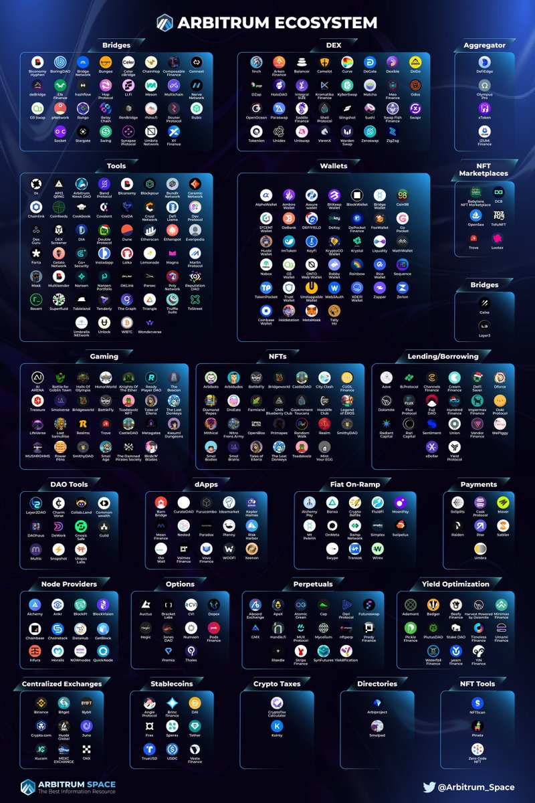
From the chart, we can observe that the development of DeFi, DEX, and GameFi on Arbitrum is extremely rapid

### 2.1 DeFi

**2.1.1 Camelot**

Camelot is an ecosystem-centric and community-driven Decentralized Exchange (DEX) that allows liquidity pool builders and users to leverage its customizable infrastructure for deep, sustainable, and adaptable custom liquidity. Camelot supports the launch of new protocols on Arbitrum, providing tools for initiating, guiding, and maintaining growth liquidity.

**2.1.2 Pendle Finance**

Pendle Finance is an innovative, permissionless DeFi yield trading protocol that enables users to manage their yields effectively. It allows users to separate and purchase the yield derived from staked ETH at a discounted rate. Pendle uniquely transforms yield tokens into standardized yield tokens (SY) and separates them into two distinct types: principal tokens (PT) and yield tokens (YT). These tokens can be traded using a custom V2 Automated Market Maker (AMM). In this system, PTs operate similarly to zero-coupon bonds, while YTs function like coupon payments, providing a unique approach to yield management in the DeFi space.

**2.1.3 Radient Finance**

Radiant Finance is a pioneering lending protocol built on the LayerZero architecture. Originating on Arbitrum, it has expanded to the BSC public chain to create a cross-chain lending protocol. This allows users to deposit on the Arbitrum public chain and borrow, and withdraw assets on other public chains such as Polygon, ETH, and BSC. Previously, such complex operations required the use of multiple lending protocols and cross-chain bridges simultaneously. Radiant Finance simplifies this process by offering a one-click solution.

As we move towards a future with multiple coexisting chains, the problem of liquidity fragmentation across different public chains needs to be addressed. Radiant Finance solves this issue by allowing users to move freely between various public chains. This functionality sets Radiant Finance apart from mainstream lending protocols such as Aave and Compound, which do not currently offer this feature.

**2.1.4 GMX**

GMX is a Decentralized Exchange (DEX) specializing in spot and perpetual contract trading, particularly on derivatives. Initially launched on the BSC chain as Gambit, GMX has since transitioned to Arbitrum and extended its support to the Avalanche (AVAX) chain. Setting itself apart from platforms like dYdX and PerpetualProtocol that utilize order book or AMM models, GMX employs a global liquidity model. This model allows users to provide liquidity not by supplying two tokens in a 1:1 ratio, such as ETH/USDT, but by directly purchasing and staking the GMX-issued liquidity token, GLP. By staking GLP, users effectively participate in GMX's market-making.

### 2.2 GameFi

**2.2.1 Treasure Dao**

Treasure aims to create a "Decentralized Wonderland" composed of a series of on-chain games. These games are interconnected through the interoperability of in-game assets and using Treasure's native token, MAGIC, as a shared currency. The platform hosts a variety of popular games, including strategic games like Bridgeworld, role-playing games like The Beacon and Smolverse, and resource management and strategic games like Realm.

## 3. Potential Hotspot Narratives

**3.1 Cancun Upgrade** 

Major Ethereum upgrades are always noteworthy events in the Web3 space. The Shanghai upgrade in the first half of this year sparked a wave of LSD Summer. On [ACDE#163 3](https://github.com/ethereum/pm/issues/786), the scope of the Cancun upgrade was finalized.  The Cancun upgrade includes EIP 4844, EIP 1153, EIP 4788, EIP 5656, and EIP 6780(The list of included EIPs can be found in [cancun.md 87](https://github.com/ethereum/execution-specs/blob/master/network-upgrades/mainnet-upgrades/cancun.md#included-eips)), with the most notable being the capacity expansion-focused proposal, EIP-4844.

**3.1.1 Data Availability is The Critical Bottleneck for Scalability.**

In a roll-up transaction, the costs are divided into execution, storage/state, and data availability. The first two costs are incurred on the Rollup network and constitute a minor portion of the total cost. The significant bottleneck is the cost of data availability, which involves publishing data to Layer 1 (L1).

Data availability is essential as it allows anyone to reconstruct the state without permission. The scalability provided by Layer 2 (L2) is achieved by separating execution checks and data security. This separation allows us to synchronize and obtain data to verify the state without direct influence from the sequencer.

Currently, rollups upload data to L1 as calldata, which is expensive and inefficient. Therefore, methods such as calldata compression and EIP-4488, which reduces the cost of calldata from 16 gas to 3 gas per non-zero byte, have been introduced.

However, using calldata is unsustainable as it brings unnecessary legacy costs to L2. The EIP-4844 proposal allows us to trim the data, as under this proposal, the data only needs to be available for a sufficient length of time for honest network participants to reconstruct the complete state and challenge the sequencer.

**3.1.2 What is EIP 4844?**

EIP-4844, also referred to as Proto-Danksharding, is a proposal aiming to lay down the groundwork for a full Danksharding specification without immediately implementing any sharding. Under this model, all validators and users are still responsible for directly verifying the availability of all data.

**Blob-Carrying Transaction:** The main innovation introduced by Proto-Danksharding is a new kind of transaction, the blob-carrying transaction. Similar to a regular transaction, a blob-carrying transaction carries an additional piece of data known as a blob. These blobs are substantial in size (~125 kB) and can be more cost-effective than comparable quantities of calldata. However, the Ethereum Virtual Machine (EVM) can only observe a commitment to the blob, with no access to the blob data itself.

**The Operation Process of Blob-Carrying Transaction**
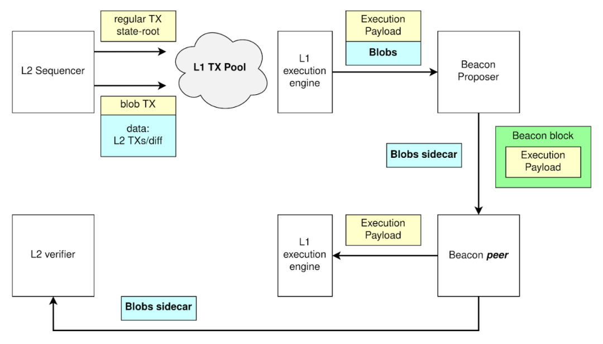
In this process, the Sequencer initially furnishes the data, which is then solidified on the Layer 1 (L1). Following this, the Blob sidecar is extracted from the Blob transaction, while the execution within the Blob transaction transpires within the Execution Payload. Subsequently, the necessary data for rollup state validation is relocated to a separate database. This allows Layer 2 (L2) validators to access, download, and synchronize these sidecars with L2, ensuring the seamless operation of the network.

**Two Remarkable Features of Blob-Carrying Transaction**

- They are inaccessible for contract reading.
- The values contained within a Blob are set for removal by the consensus layer nodes after a one-month period. Transactions have traditionally consumed block space. However, with the advent of Layer 2 (L2), Layer 1 (L1) transitions towards acting as a data layer for L2, consequently causing Calldata to occupy more block space. The scheduled deletion of Blob data offers an effective solution to the issue of state bloat on L1.

**3.1.3 How Does Proto-Danksharding (EIP-4844) Compare to EIP-4488?**

**[EIP-4488](https://eips.ethereum.org/EIPS/eip-4488)** is an earlier and simpler attempt to solve the same average-case / worst-case load mismatch problem. EIP-4488 did this with two simple rules:

- Calldata gas cost reduced from 16 gas per byte to 3 gas per byte
- A limit of 1 MB per block plus an extra 300 bytes per transaction (theoretical max: ~1.4 MB)

Proto-dank sharding is a method that creates a distinct transaction type capable of holding cheaper, large, fixed-size data blobs. There's a limit to the number of blobs per block, and these blobs are not accessible from the EVM, but only their commitments are. The consensus layer (beacon chain), not the execution layer, stores these blobs.

**The main practical difference** between EIP-4488 and proto-dank sharding lies in the extent of changes they initiate. EIP-4488 seeks to minimize immediate changes, while proto-dank sharding implements more changes now to limit future modifications necessary to upgrade to full sharding.

Though implementing full sharding is complex, even with proto-danksharding, this complexity is confined to the consensus layer. Post proto-danksharding implementation, execution layer client teams, rollup developers, and users do not need to do further work to complete the transition to full sharding. Furthermore, proto-danksharding separates blob data from calldata, making it simpler for clients to store blob data for a shorter duration.

**3.1.4 Primary Benefits of EIP-4844**

- Dedicated Block Space for Data Availability
- Reduce Costs of Layer-2 Rollups
- Introduce Forward Compatibility with Full Danksharding
- Experimentation with ZK Proofs

**3.1.5 What opportunities are worth paying attention to?**

Rollup and Danksharding stand as Ethereum's sole trustless scaling solutions for the foreseeable future and perhaps indefinitely. Clearly, this will significantly benefit the entire Layer2 Rollup landscape. It's noteworthy that Arbitrum, a topic of our discussion today, also features prominently in the Layer2 landscape.

## 4. Analysis of Layer2 Competitors

### 4.1 TVL
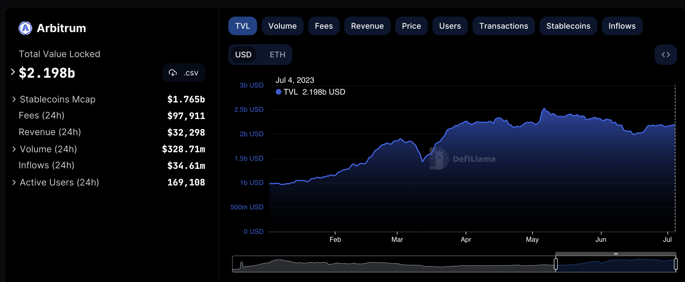
Source:Defillama

The chart above illustrates the trend of Arbitrum's Total Value Locked (TVL) from the beginning of this year to the present. We have observed a consistent growth trend since the start of the year. Arbitrum's TVL increased from $978.92 million USD at the beginning of the year to its current $2.198 billion USD, an impressive growth rate of 125%. This represents a remarkably rapid growth trajectory.
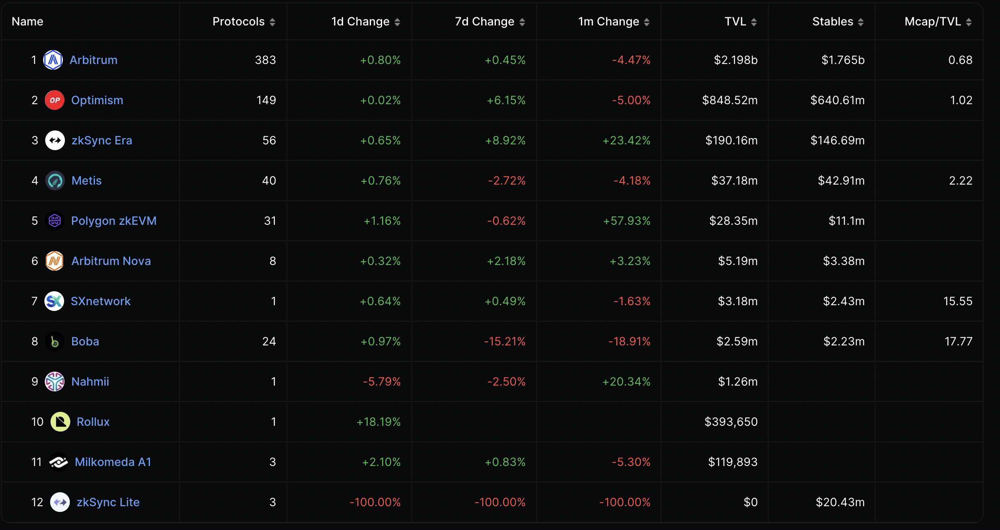
Source:Defillama

When comparing Arbitrum's data within the overall Layer2 Rollup ecosystem, whether in terms of the number of Protocols or Total Value Locked (TVL), Arbitrum maintains a leading position, significantly ahead of Optimism, which ranks second.
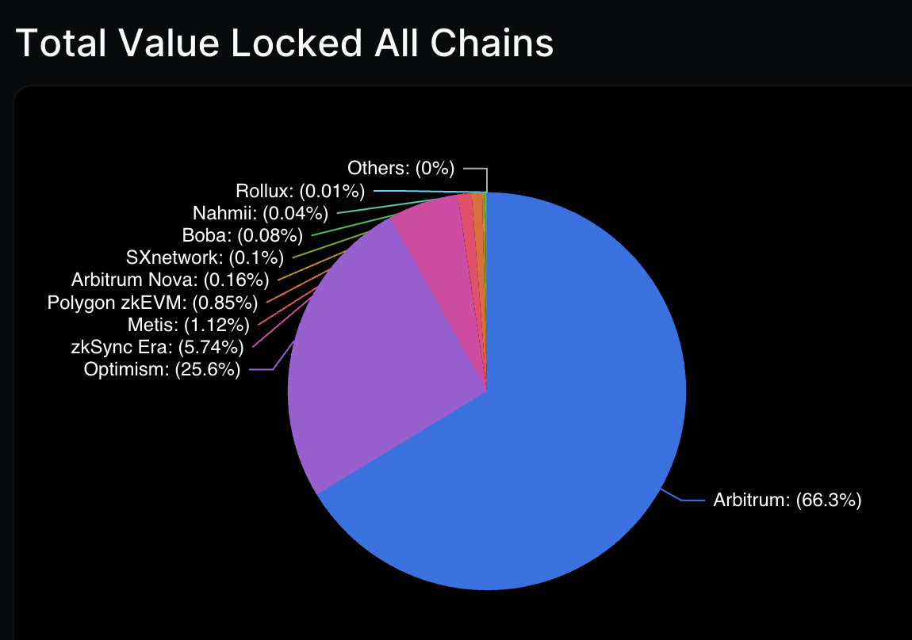
Source:Defillama

From the perspective of Total Value Locked (TVL) market share in the Layer2 Rollup ecosystem, Arbitrum holds a dominant position with a 66.3% market share, significantly ahead of Optimism in second place with 25.6%. Another crucial on-chain metric to consider is the Mcap/TVL ratio. **Currently, Arbitrum's Mcap/TVL stands at just 0.68, the lowest among all Layer 2 Rollup ecosystems with a token issuance.**

### 4.2 More Active On-Chain Users in Layer 2
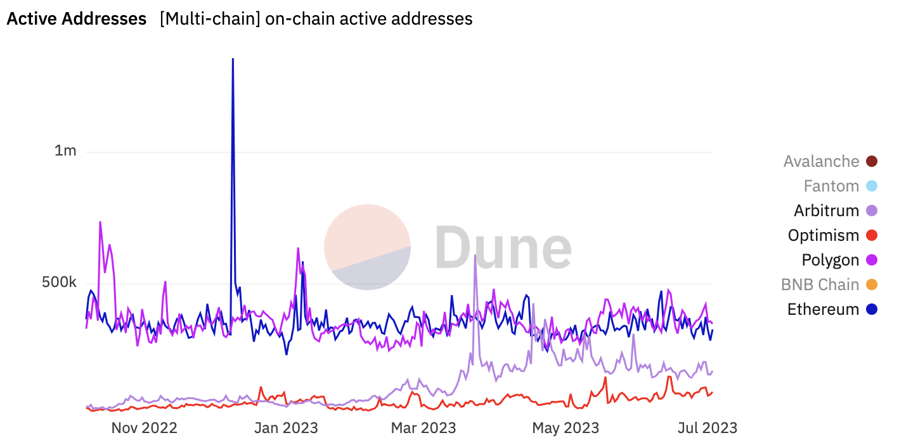
Source: Dune analytics

Ever since the launch of its token, Arbitrum's on-chain active user data has consistently outperformed that of Optimism. At times, it even surpassed the on-chain active user metrics of Ethereum and Polygon.

### 4.3 Compare Chain Transactions
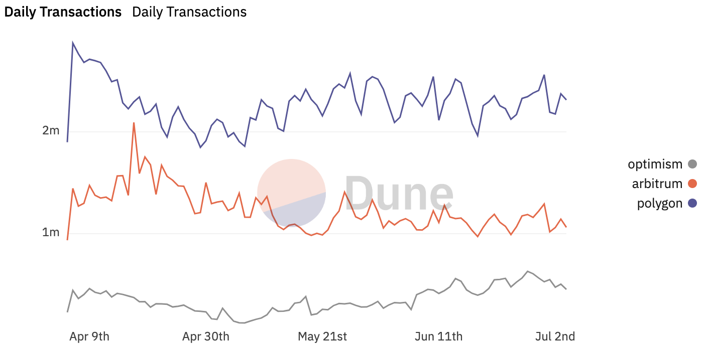
Source:Dune

From the graph, we can discern that over the past three months, Arbitrum's on-chain transaction volume has consistently overwhelmed that of Optimism, and at times, it has even approached the transaction volume of Polygon.
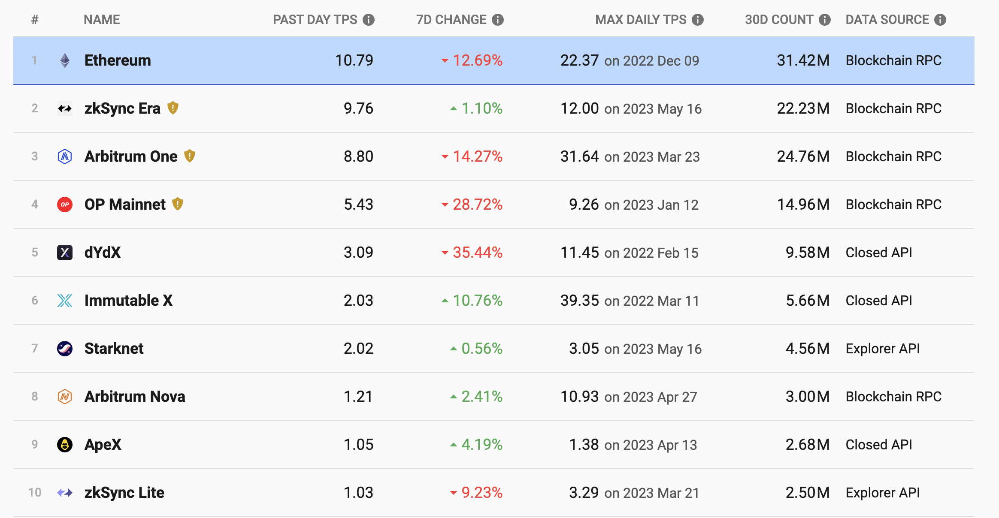
Source:L2BEAT

When we compare the transaction volume of the entire Layer 2 ecosystem with that of the Ethereum chain, we can observe that although the transaction volume on the Ethereum chain remains the highest, many Layer 2s have already approached the level of Ethereum. We can see that Arbitrum's Maximum Daily Transactions Per Second (TPS) is 31.64, ranking second in the top 10. Its transaction volume over the past 30 days has reached 24.76 million, ranking first in the Layer 2 domain.
### 4.4 What Is The Most Profitable L2?
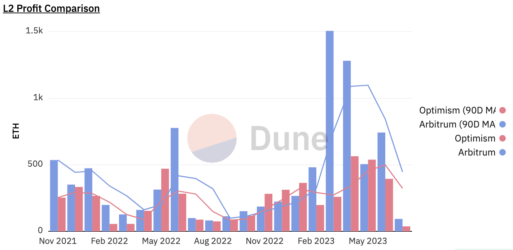
Source:Dune

Profitability is also a key metric in evaluating a project. In this case, considering our Layer 2 tokens already issued, namely Arbitrum and Optimism, the L2 Profit Comparison chart reveals that Arbitrum's revenue outperforms Optimism's most often. In March 2023, when Arbitrum was issued, its revenue peaked at 1,506 ETH. At least based on the current data, Arbitrum remains the most profitable layer 2.

Another point that we should not overlook is that a multitude of different types of projects are currently under development on Arbitrum, enriching the ecosystem of Arbitrum. This is beneficial for increasing the transaction volume and revenue on Arbitrum. Moreover, due to its potential promotional effect on Layers, the Cancun upgrade might to a certain extent, boost the development of Arbitrum's ecosystem and amplify the growth of transaction volume and revenue on Arbitrum.

### 4.5 Token Release Plan with Greater Investment Potential
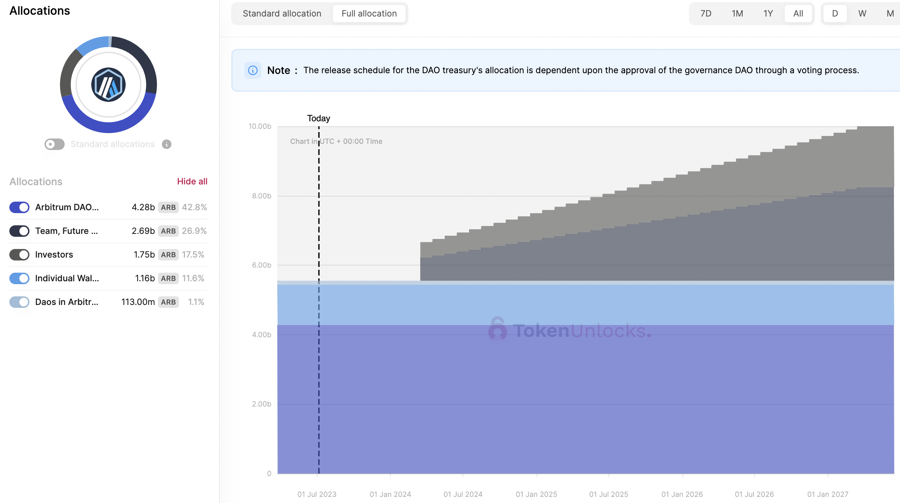
Source: [Token Unlock](https://token.unlocks.app/arbitrum)

The schedule for the token release of Aritrum, as depicted in the provided diagram, reveals no new ARB tokens being introduced into circulation from the present moment until March 2024. It is highly anticipated that the Cancun upgrade will be completed by the end of 2023. This suggests that no new ARB tokens will be released throughout the period of narrative development and completion of the Cancun upgrade, thereby eliminating any potential selling pressure. This condition sets a favorable environment for the healthy appreciation in the price of ARB tokens.

**Optimism Token Release Schedule**
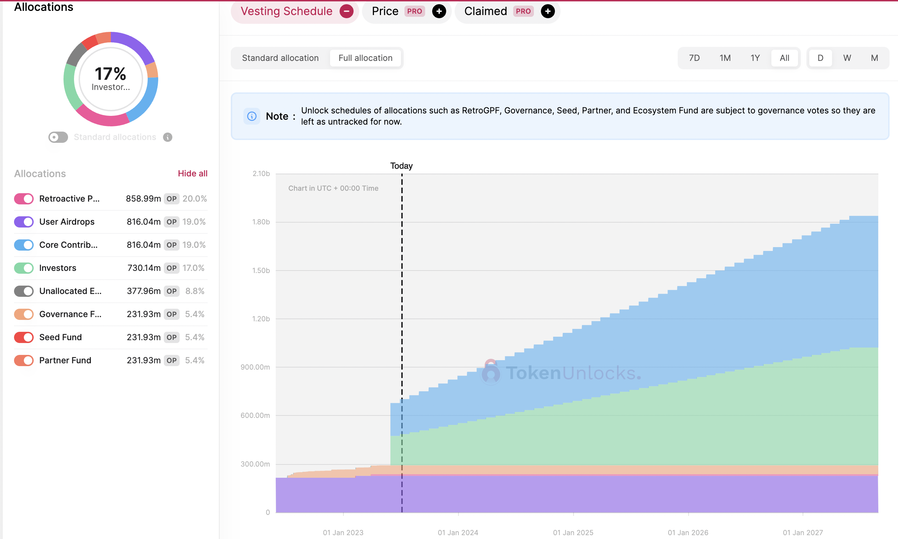
Source: Token Unlock

The above chart displays the token release schedule for Optimism. **As we can see, from now until March 2024, approximately 251 million OP tokens, accounting for 39% of the current token supply and 5.8% of the total issued token supply, will be released**. This new token release is primarily composed of Core Contributors and Investors.

Given the quantity, OP tokens will still face substantial potential selling pressure from the sizable token release during the Cancun upgrade. However, it is fortunate that these tokens are not released all at once but gradually over time, providing the market with an opportunity to absorb the selling pressure incrementally. As a result, there may not be significant price volatility during this period. Yet, prior to each token release, there remains a certain opportunity for short selling.

## 5.$ARB Token Data Analysis

### 5.1 On-Chain Big Whale Analysis

[$ARB Top 100 Traders Data](https://docs.google.com/spreadsheets/d/1R5ZBOHaaGetG8xIzlGC0lcuH_R6ytDBrE5UfwoYQMbs/edit?usp=sharing)

We have conducted an in-depth analysis on the on-chain data of the Top 100 traders of $ARB, the detailed information can be found in the attached link. Based on our statistical analysis of this data, it is apparent that the average cost basis for these significant on-chain entities is $1.29, with an average rate of return of -12.51%.
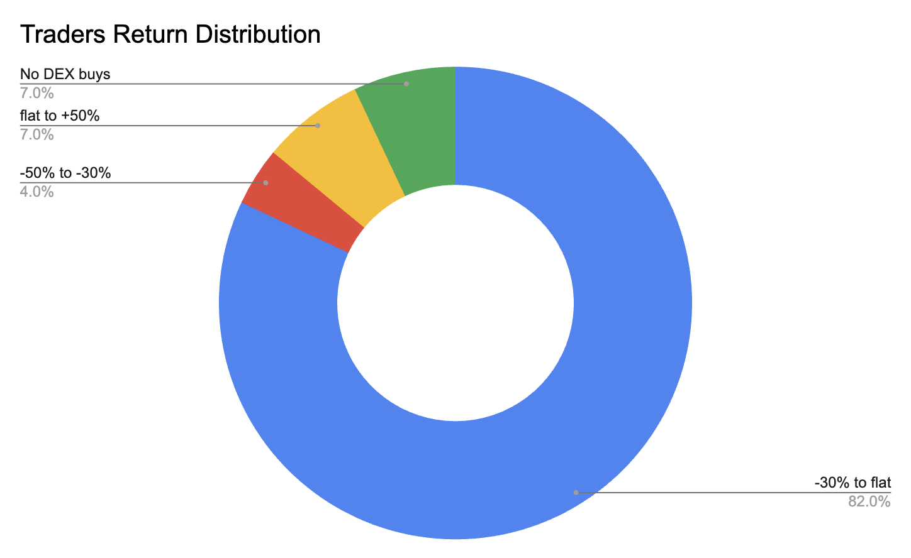
Data Source: from [BTX Research](https://dune.com/btxresearch/arbitrum) 

**When categorizing the returns of these Top 100 traders, we find that only 7% of these major on-chain traders are profitable, while 82% face losses.** Nevertheless, despite the prevailing negative returns among these major holders, none of them have shown any signs of reducing their positions in the past 7 days. **In fact, only three holders have scaled down their holdings over the past 30 days.** Despite the current market downturn, this steadfast holding pattern among most traders suggests a prevalent confidence in the value of the $ARB token.

We should also note that, over the past 30 days, 35 of the top 100 traders, representing 35%, have elected to either increase their existing positions or initiate new ones. We further examined the subset of traders who had added most significantly to their holdings. **For instance, the trader identified as 0x3737 began consistently acquiring additional $ARB tokens following a significant decline in its price.** **The average cost for these additional purchases is approximately $1.07.** Importantly, this trader has increased their position, with no evidence of any sell-offs or profit-taking. **Similarly, the trader known as 0x83ee has an average acquisition cost of around $1.15, with these purchases representing 98.3% of their current holdings. Even during periods of price decline, this trader did not undertake any stop-loss measures.**

There are exceptions amongst these major holders. For example, the holder identified as 0x92fe sold a portion of their tokens on June 10, 2023, to mitigate risk during a substantial price drop, appearing less like a staunch holder. However, this trader proceeded to reaccumulate at a price point of approximately $1.14 on June 30, 2023. Other major holders have average acquisition costs in the range of $1.00 to $1.15. These traders have not been prompted to sell their holdings due to falling prices. Quite the contrary, many have taken advantage of these lower prices to increase their positions, thereby reducing their average cost basis.

### 5.2 Valuation

**Project Key Metrics**

| Project | Arbitrum ($ARB) | Optimism($OP) | Polygon ($MATIC) |
|---------|-----------------|---------------|------------------|
| Current price Date:06-July-2023 | $1.11 | $1.23 | $0.67 |
| Market Cap | $1,413,666,018 | $794,878,303 | $6,239,706,193 |
| FDV | $11,087,576,610 | $5,296,313,918 | $6,695,345,139 |
| TVL | $2,164,000,000 | $851,830,000 | $961,730,000 |
| Mcap/TVL | 0.65 | 0.93 | 6.49 |
| FDV/TVL | 5.12 | 6.21 | 6.96 |
| Transaction Fees (30d) | $4.25m | $2.29m | $2.71m |
| Revenue (30d) | $1.32m | $686.58k | $1.78m |
| Active users (30d average) | 169.67k | 87.27k | 368.98k |
| Circulating supply | 1,275,000,000 | 644,594,782 | 9,319,469,069 |
| Total Supply | 10,000,000,000 | 4,294,967,296 | 10,000,000,000 |
| Circulating Percentage | 12.75% | 15.01% | 93.19% |

Presently, the sole function of the ARB and OP tokens is governance, affording holders the capacity to vote on the future direction of the projects. However, past proposals have incited confusion, undermining the certainty of voting rights. From a revenue standpoint, this only confirms that the Arbitrum protocol and project have a certain earning potential, yet the ARB token has not demonstrated any value capture in this regard.

We currently lack a [robust valuation model](https://digitalcommons.pepperdine.edu/cgi/viewcontent.cgi?article=1002&context=jef) for this type of governance token. Thus, for this study, **we use the Mcap/TVL** (Market Capitalization to Total Value Locked) **ratio**, a key metric, for ARB's valuation. It is also important to note that using the Mcap/TVL ratio for ARB's valuation will only remain valid until the next token release of $ARB. As we previously highlighted, a substantial release of tokens will occur during the next unlock, which could trigger substantial fluctuations in the Mcap/TVL valuation and thereby render the current valuation invalid.

**$ARB Valuation Based on Mcap/TVL**

| Mcap/TVL | $ARB Price |
|----------|------------|
| The Mcap/TVL value of Optimism | 0.93 | 1.59 |
| The mean of Polygon and Optimism | 3.71 | 6.34 |
| The Mcap/TVL value of Polygon | 6.49 | 11.08 |

*Source:BTX Research*

Utilizing the Mcap/TVL ratio as a metric, we have estimated the token price for the upcoming token release and during the Cancun upgrade period, projecting a potential future price range of $1.59 to $11.08. Coupled with our previous whale analysis, where the average cost basis of the whales was found to be around $1.29, and considering that the typical accumulation range for major holders during prior price plunges was between $1.00 and $1.15, it appears that, even at a conservatively estimated price of $1.59, significant holders still have room for future profits.

For retail investors with less available capital, a viable strategy could involve buying $ARB tokens at a price lower than the major holders' average accumulation cost or within the accumulation range of these significant holders. This approach could result in a more favorable risk-reward ratio for retail investors.

## 6.Conclusion

In conclusion, Arbitrum represents a significant advancement in Layer 2 scalability solutions for the Ethereum network. Its unique use of Optimistic Rollup technology and a multi-round interactive challenge protocol demonstrates a novel approach to enhancing network performance and reducing dispute resolution costs.

The strong academic and professional background of the Offchain Labs team, which is behind Arbitrum, ensures a deep understanding of blockchain technology's theoretical and practical aspects. This knowledge and experience uniquely position them to address the scalability challenges faced by Ethereum and other blockchain platforms.

The rapid development of the Arbitrum ecosystem, particularly in the areas of DeFi, DEX, and GameFi, underscores the platform's potential for fostering innovation and growth in the blockchain space. Notable projects such as Camelot, Pendle Finance, Radiant Finance, GMX, and Treasure Dao are a testament to the diverse range of applications that can be built on Arbitrum.

Major Ethereum upgrades like the upcoming Cancun upgrade will likely stimulate development in the Ethereum ecosystem further. As a Layer 2 solution for Ethereum, Arbitrum benefits significantly from these advancements. Therefore, it is crucial for stakeholders to closely monitor the progress of Arbitrum and its ecosystem, as it is poised to play a pivotal role in the future of Ethereum and the broader blockchain landscape.

### Disclosure

*All content was produced independently by the author(s) and does not necessarily reflect the opinions of BTX Research. Author(s) may hold cryptocurrencies named in this report. This report is meant for informational purposes only. It is not meant to serve as investment advice. You should conduct your own research and consult an independent financial, tax, or legal advisor before making any investment decisions. Nothing contained in this report is a recommendation or suggestion, directly or indirectly, to buy, sell, make, or hold any investment, loan, commodity, or security or to undertake any investment or trading strategy with respect to any investment, loan, commodity, security, or any issuer. This report should not be construed as an offer to sell or soliciting an offer to buy any security or commodity. BTX Research does not guarantee the sequence, accuracy, completeness, or timeliness of any information provided in this report.*